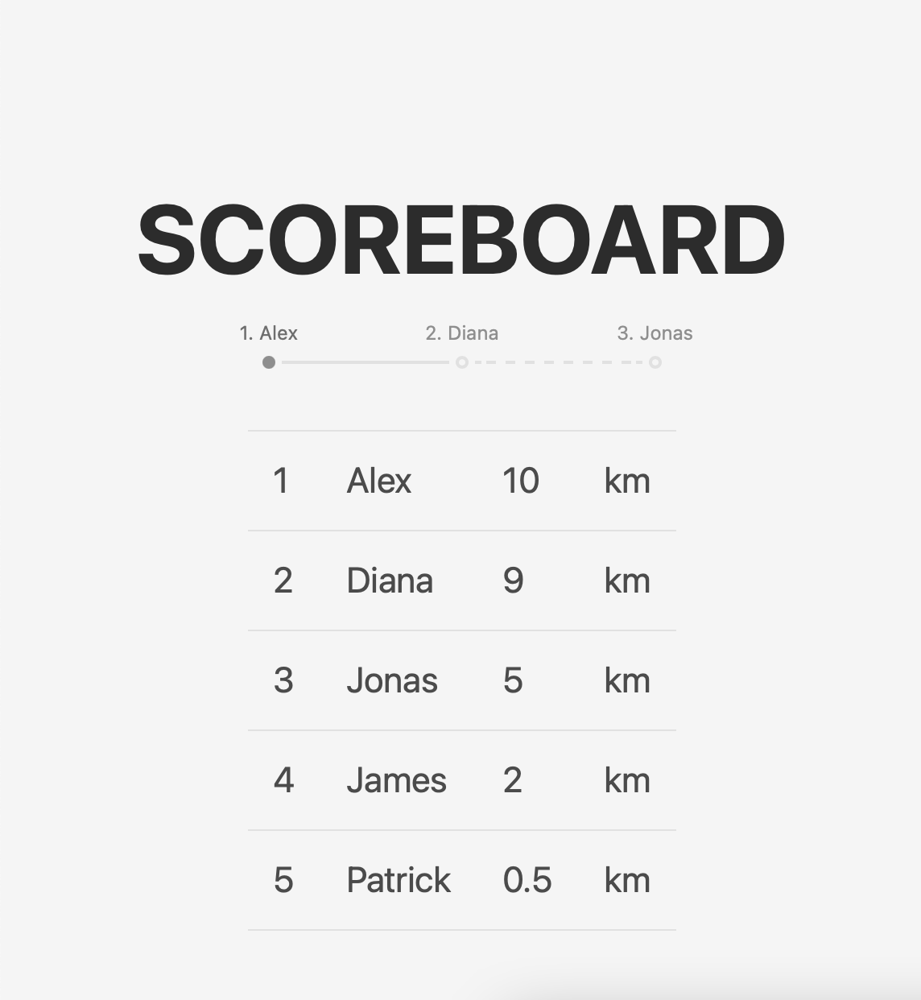

# Scoreboard

Scoreboard using [headless cms](https://prismic.io/)

## Preview



## Config

The config file is located [here](./src/scripts/config.json.ts)

## Prismic types

See [CustomType.md](customType.md)

## Dev

```shell
yarn run dev
```

### Deploying

```shell
yarn run deploy
```
